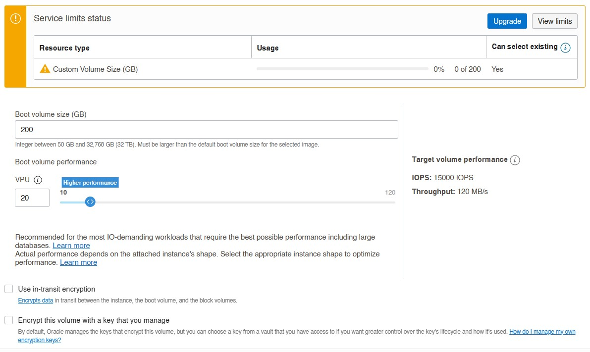

# Conan-Exiles-Free-Game-Server-Setup-Using-Oracle-Cloud

Oracle Cloud allows us to create an Always Free Tier Cloud Server that runs on Linux. However, the largest issue we will run into are a few things.

* The Conan Exiles Server is Windows based
* The Oracle Cloud Server we are creating is arm64 based, different than a standard amd64 or i386.
* We will need to run an emulation in order to run Wine, but everything needs to work on this architecture.

Thankfully, we can utilize box86/box64 

Another issue is performance which I have not have been able to test as of yet. So far, a light modded to no-modded server has given suitable results to run a server outside my home. Boot up time for a minimal server or with light mods clocked in around 5 minute mark. Not as fast but good enough for a free server.

 A heavy modded server (roughly 30 mods) takes about 11 minutes to boot up, but has so far been okay. I haven't tried heavier mods suchs as AoC, EEWA, and VAM, which I expect the bootup times for these to increase quite a bit.

# Getting the server ready #

You will first need to sign-up for your free server. They give you $300 in credit for the first 30 days, but we will not be needing to use it as we are sticking with the free tier. Even after the 30 days, as long as you stuck with the free tier option, it will be free forever.

 https://www.oracle.com/cloud/free/

Keep in mind, you will most likely have to use a CC for verification but they will not charge you for it. As of now, I believe Oracle does not allow the usage of prepaid or virtual cards. 

Also, when you set your home, I would advise to set it geologically as close to you as you can. While it may not be a huge deal, I'm sure being closer in proximity will help with connection delay if you wish to remote desktop in and utilize the desktop.

# Creating the Virtual Machine #

It's time to get started. We will need to create a new VM instance. If you're a new user, you may have a different screen than I do.

Let's go ahead and create one. If you don't see this screen, head to the hamburger menu on the top left, type in "instances", and click instances in the search results.

Now it's time to Create an instance

# Setting it Up #

You can name your instance here if you wish. If this is the only server you will be running, you can just leave it on default. However, this part is optional.

## Placement ##

The first segment you will see is the placement. Placement is just the domain and there are generally three available ones. I'll mention it again at the end of this VM setup. For now, you can leave it at default.

## Image and Shape ##

### Image ###

We are going to edit this by clicking edit and the following will show.

    Let's go ahead and choose an image. When the menu opens on the side, choose Canonical Ubuntu. We will use 22.04 which is the default version as of writing. Select image and move on to change shape.

### Shape ###

Select Ampere for this one, select the shape name VM.Standard.A1.Flex.

Then move the slider to the right so you get 4 OCPU and 24 GB of RAM

    **Keep in mind, if you are wanting to have multiple servers, you will need to divvy this up to smaller chunks at the expense of hardware performance.**

Once you select your shape, move down to Add SSH Keys

## SSH ##

We are going to need to get access to our instance. You will need to head over to https://www.putty.org/ and install the client based on your operating system.

When ready we will need to generate a private key. 

1. Open PuTTYgen.
2. Click generate and move mouse over the empty box until a key is created.

3. Copy the new key and paste it in the instance.

4. Save the private key somewhere safe. It will save as a *.ppk

## Boot Volume ##

The same goes for the above when choosing the size of your shape. If you want multiple servers, make sure you can fit the volume size. In this case, it's a max of 200GB. This is the size I will be choosing for the sake of utilizing everything the free tier has to offer.

You can also set the VPU boot performance to 20 which is the max you can do for free tier, although I haven't seen a noticable different on performance.

    **Also, make sure Use in-transit encryption is UNCHECKED**

## Once you're done, Create it ##

I've noticed the first time you hit create, a red box pops up. Just try again. If you get the error, Out of Capacity for Shape, head back to the top and choose a different domain placement and try again.

Once done, your instance will provision and you just created the oracle cloud server.

# Setting Up Firewall Ports #

We need to open the ports to the public and for the server to be queried on the server browser.

Click on subnet, then Default Security List on the next page. It should take you to the firewall rule table.

Let's Add Ingress Rule.

We will be creating multiple ones. When you fill out one rule, you can subsequently create another rule on the right that says `+Another Ingress Rule` I will list them all but set the SOURCE CIDR to `0.0.0.0/0` and Destination Port Range to the following:

* Game Client 7777 / IP Protocol UDP
* Raw UDP Port 7778 / IP Protocol UDP
* Steam Query Port 27015 / IP Protocol UDP
* RCON Port 25575 / IP Protocol TCP

We'll also add an RDP port for remote desktop support, in case you ever want to use a GUI. I'll have us install it for future use.

* RDP 3389 / IP Protocol TCP

Follow the format for all 5.

When done head back to the instance page where you created your instance. (Hamburger, instance, your new instance) It may be pinned as well.

# Let's Log-in #

Find your ip address on the main instance page.

Copy your unique ip address and open up PuTTY  (Not PuTTYgen)

You will be inputting the default username, which is `ubuntu@youripaddress`

Head down to SSH open the dropdown box and select Auth.

Find your private key you saved and load that into the program.

When done, go back to the first image above and save the session to get back to it whenever you want. When you're ready, open it and hit Accept when a box pops up.

# Time for the Real Deal #

Now it's time to get this going. Let's go ahead and get everything updated. You can easily copy the code then right click into the putty screen and hit enter. 

Thanks to NicoD and a team over at Armbian-Gaming, I pooled together what's needed to get the Conan Server running. There will be a repository of files that is needed to make this work.

# Install #

It's time to clone this repository and execute the ordeal.

Copy paste this in your SSH

`git clone https://github.com/dafitime/Conan-Exiles-Server-Oracle-Cloud-Edition.git | cd Conan-Exiles-Server-Oracle-Cloud-Edition `

